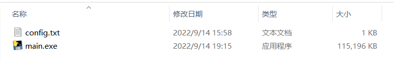
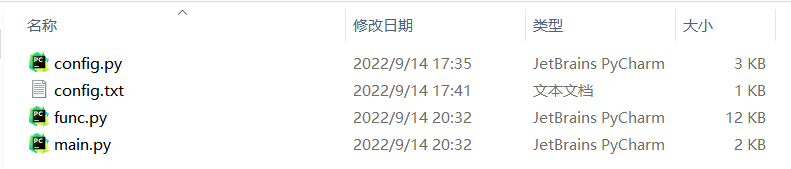
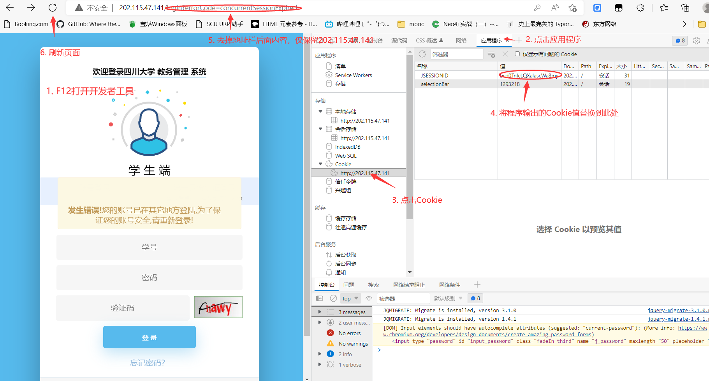
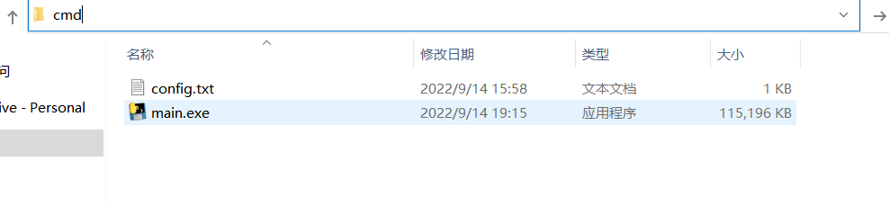
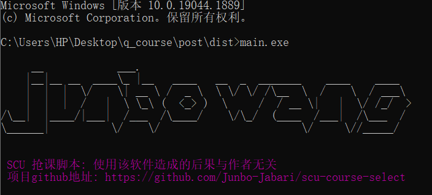

# 四川大学选课
scu选课脚本

**Windows系统可执行文件下载地址：http://120.48.78.248/course_select/res/main.exe**

如果浏览器提示无法安全下载，属于误报，保留下载即可。

## 如何使用

### Windows系统

- 下载exe打包文件
- 编辑 [config.txt](./config.txt)（与exe文件放在同一目录），具体格式可根据文字提示填写，也可以参照 [example_config.txt](./data/example_config.txt) 的例子编辑；如果需要一次性抢多门课程，请参照[mul_example_config.txt](./data/mul_example_config.txt) 进行编辑。方案计划号请见**常见问题**板块。

文件结构如下：



双击 `main.exe` 即可运行。


### 熟悉python的同学

- exe文件有接近112MB，占用空间较大。如果使用者熟悉python，可直接下载本项目主目录下的四个文件：`main.py` `fun.py` `config.py` `config.txt` 。
- 运行环境 `python3.8` ,建议 python3.7-python3.9 ,其余版本部分库可能不兼容需要微调。

 文件结构如下：



配置好 `config.txt`后，在该目录下，控制台运行指令 `python main.py`即可运行。当然也可以用 `pycharm` 等编辑器打开运行。


### 使用须知

- 本程序抢课的原理就是不断刷新课余量，一旦有课余量就选择该课程；简而言之，代替了人工'蹲课'的行为。
- 运行程序前请务必确认满足所选课程要求（年级限制、专业限制、课程时间等），否则程序会判断有课余量然后一直发送选课请求，一直选课失败，从而被教务处发现。
- 请谨慎使用本程序，如被教务处请喝茶，与作者无关。

## 常见问题：

- Q：什么是*方案计划号* ？

  A：是教务处区别不同培养方案计划的代号，开发者已整理好 2019级-2022级 所有的培养计划，详情见 [方案计划号](./data/fajhh/data.xlsx) 。找到自己专业对应的方案计划号后填入 `config.txt` 即可。

  

- Q：为什么 `main.exe` 这么大？

  A：`pyinstaller` 打包会将用到的模块全都打包成exe；本程序使用了验证码识别库 `ddddocr` 这部分体积是相当大的。

  

- Q：为什么刚打开 `main.exe` 报出如下错误？

  ```bash
  Traceback (most recent call last):
      File "main.py", line 39, in <module>
      File "func.py", line 284, in main
      File "func.py", line 53, in login
      File "func.py", line 30, in get_captcha
      File "ddddocr\__init__.py", line 1604, in classification
      File "ddddocr\__init__.py", line 16, in base64_to_image
      File "base64.py", line 80, in b64decode
      File "base64.py", line 45, in _bytes_from_decode_data
      TypeError: argument should be a bytes-like object or ASCII string, not 'NoneType'
      [16928] Failed to execute script 'main' due to unhandled exception!
  ```

  A：你可以尝试关闭代理或者检查网络。

  

- Q：抢课脚本和教务管理系统可以同时登陆吗？

  A：运行抢课脚本后，本地的教务系统会被踢出去；如果本地再次输入学号密码登录，脚本则会运行异常退出。

  ​      如果相同时登录，我们在程序最开始打印了脚本运行时的 `cookie` 信息，将其粘贴到浏览器中即可同时登录，具体步骤如下：

  


- Q：双击 `main.exe` 后闪退怎么办？

  A：可以选中当前文件目录，输入 `cmd` 并按下回车键，弹出命令行窗口

  

  输入 `main.exe` 即可运行

  


- 更多问题欢迎留言： 809083837@qq.com


## 支持我们

​	请给本项目点个 **star**

